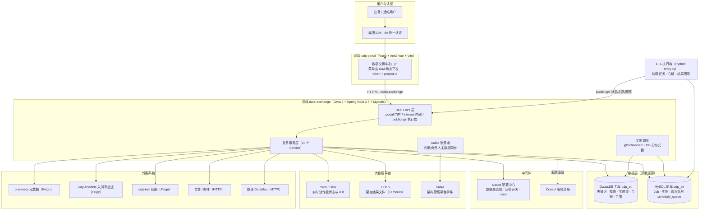
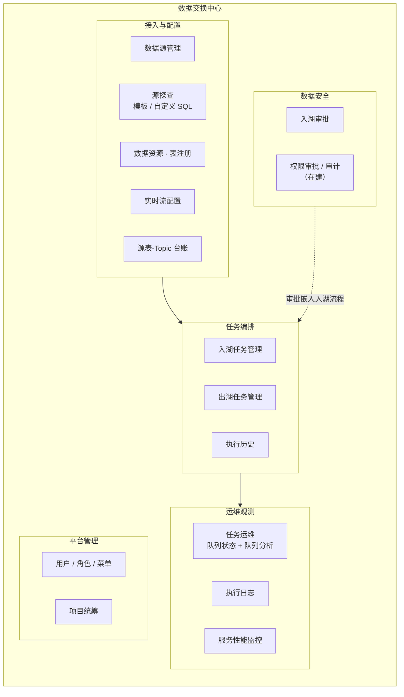
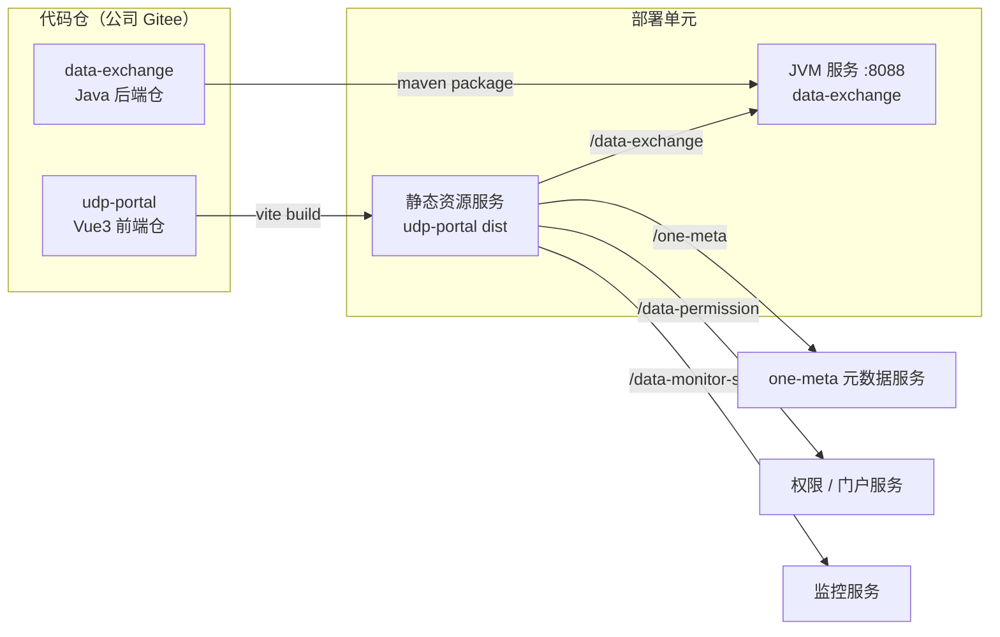
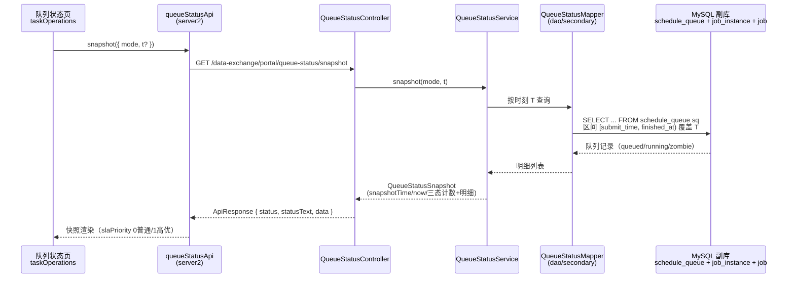
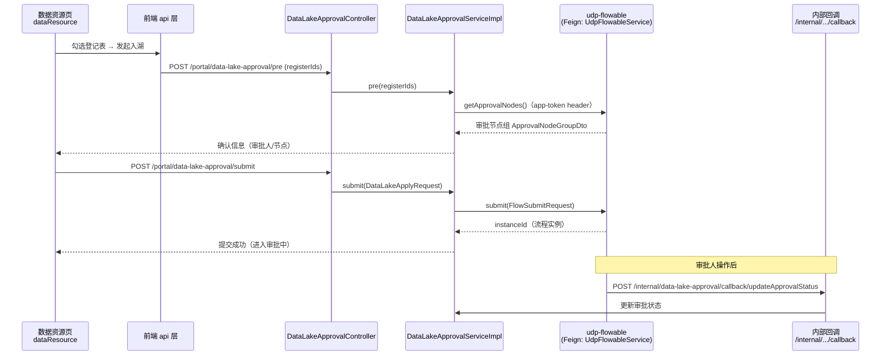

# 架构全景（数据交换中心）

> 冷启动：2026-09-11 · 图源迁移自 `核心文档/技术介绍/数据交换中心-架构图与功能模块图.md`（同源维护，改图两边同步）。
> 高清汇报版见 FigJam：https://www.figma.com/board/1ivxnU32PajFyG0cANjmEB
> 前后端分两个仓（udp-portal / data-exchange），但对外是同一个系统，图按「系统」组织。

## 1. 系统架构图（集成视角）

要点：双数据源分工见 DECISIONS.md#D1；执行端经 `public-api` 解耦；审批外链（DataReviewPage）走白名单 token。

## 2. 功能模块图（业务能力视角）

业务域 ↔ 代码映射（答疑用）：

| 业务域 | 前端 views | 后端 API | 主要数据表 |
|--------|-----------|---------|-----------|
| 数据源管理 | `dataExchange/sourceManagement` | `/portal/datasources` | `datasource_info`（副库） |
| 源探查 | `dataExchange/explorationManagement` | `/portal/explore-source*` | `explore_source*`（主库）+ HDFS |
| 表注册/数据资源 | `dataExchange/dataResource` | `/portal/table-register` | `table_register`（主库） |
| 实时流 | `dataExchange/liveStreamManagement` | `/portal/real-time-stream` | `real_time_stream`（主库）+ Yarn/Kafka |
| 源表-Topic 台账 | `dataExchange/sourceTopicLedger` | `/portal/source-topic-ledger` | `source_topic_ledger`（主库） |
| 出入湖任务 | `dataExchange/taskManagement/*` | `/portal/jobs`、`/portal/task_manager` | `job` / `job_instance`（副库） |
| 任务运维（SLA） | `dataExchange/taskOperations` | `/portal/queue-status`、`/portal/queue-analysis` | `schedule_queue` / `job_instance`（副库） |
| 执行日志/历史 | `dataExchange/execute_log`、`taskExecuteHistory` | `/portal/execution-history`、`/portal/task_log` | `job_instance_log`（副库） |
| 入湖审批 | `dataSecurity/LakeEntryApproval` | `/portal/data-lake-approval` + flowable 回调 | 审批流（udp-flowable） |
| 平台管理 | `platformManagement/*` | `/data-permission`（独立服务） | — |

## 3. 前后端映射图（仓 → 部署）

要点：前端 `serverType` 四路分流（仅 `/data-exchange` 到本系统后端）；菜单由 IAM 下发 + 前端 `import.meta.glob` 映射 `views/**/index.vue`（DECISIONS.md#D2）；两仓独立发版，功能上线通常要求前后端同分支成对合并。

## 4. 联动时序图：队列状态查询（SLA 迭代新增）

## 5. 联动时序图：入湖申请提交（含 flowable 审批）

> ⚠️ 本图是**目标链路**。前端现状仍调旧路径 `/portal/table-ingestion-approvals/*`，后端无此端点——见 API-CONTRACT.md「待澄清」P0-1，处置结论出来前审批链路以本图为准做对照。
